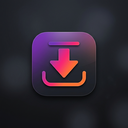

<p align="center">
  
</p>

<h1 align="center">InstaSaver</h1>

<p align="center">
  <strong>Download Instagram Stories, Reels & Posts with a single click.</strong>
</p>

<p align="center">
  
  
  
  
  
</p>

---

## ✨ Features

- 📸 **Download Posts** — Save any photo from your feed or explore page
- 🎬 **Download Reels** — Save reels in full HD quality with audio
- 📖 **Download Stories** — Save stories (both photos and videos) before they disappear
- 🎠 **Carousel Support** — Navigate to any slide in a multi-image post and download that specific one
- 🔒 **Privacy-First** — No data collection, no external servers, no tracking. Everything runs locally in your browser
- ⚡ **One-Click Save** — Download buttons are injected directly into the Instagram UI
- 🎨 **Beautiful UI** — Instagram-themed gradient buttons that blend naturally with the interface

## 📥 Installation

Since this extension is not on the Chrome Web Store, you'll need to install it manually:

### Step 1: Download

```bash
git clone https://github.com/Prince-Kadian/InstaSaver.git
```

Or download the ZIP from the [Releases](https://github.com/Prince-Kadian/InstaSaver/releases) page.

### Step 2: Load in Browser

#### Chrome / Brave / Edge

1. Open your browser and navigate to the extensions page:
   - **Chrome**: `chrome://extensions`
   - **Brave**: `brave://extensions`
   - **Edge**: `edge://extensions`

2. Enable **Developer mode** (toggle in the top-right corner)

3. Click **"Load unpacked"**

4. Select the `InstaSaver` folder (the one containing `manifest.json`)

5. The extension icon should appear in your toolbar! 🎉

## 🚀 How to Use

### Downloading Posts
1. Scroll through your Instagram feed
2. A gradient **"Save"** button appears at the top-right of every post
3. For carousel posts (multiple images), **swipe to the slide you want** first
4. Click **Save** — the image/video downloads automatically

### Downloading Reels
1. Open any reel on Instagram (`instagram.com/reels/...`)
2. A **"Save Reel"** button appears at the top-right
3. Click it — the reel downloads in the highest available quality with audio

### Downloading Stories
1. Open someone's story (`instagram.com/stories/username/...`)
2. A **"Save Story"** button appears at the top-right
3. Click it — the story (photo or video) downloads with full quality and audio

## 🏗️ Architecture

```
InstaSaver/
├── manifest.json      # Extension configuration (MV3)
├── content.js         # Main script — injects download buttons, handles media extraction
├── injector.js        # Runs in page context — intercepts Instagram's data loading
├── background.js      # Service worker for download management
├── styles.css         # Styling for injected buttons and notifications
├── popup.html         # Extension popup interface
├── popup.js           # Popup logic
└── icons/
    ├── icon16.png     # Toolbar icon
    ├── icon48.png     # Extensions page icon
    └── icon128.png    # Install/store icon
```

### How It Works

InstaSaver uses a multi-layered approach to extract media URLs:

1. **Instagram API** (Primary) — Extracts the post shortcode, converts it to a media ID, and queries Instagram's internal API for the highest-quality media URL
2. **Page HTML Parsing** (Fallback) — Fetches the page HTML and uses regex patterns to find `video_url`, `playback_url`, or direct `.mp4` URLs
3. **Fetch/XHR Interception** (Fallback) — Hooks into `window.fetch` and `XMLHttpRequest` in the page context to capture media URLs as Instagram loads them
4. **DOM Inspection** (Last Resort) — Finds the currently visible image in the DOM and extracts from `srcset`

All downloads happen via **blob fetch** — the media is fetched with Instagram cookies, converted to a blob, and saved locally. No external servers involved.

## ⚙️ Technical Details

| Feature | Implementation |
|---------|---------------|
| Manifest Version | V3 (latest Chrome standard) |
| Content Script Worlds | `MAIN` (injector) + `ISOLATED` (content) |
| Carousel Detection | Dot indicator analysis + visible slide detection |
| Video Quality | Highest resolution from `video_versions` array |
| Download Method | Blob-based with `credentials: 'include'` |
| Button Injection | MutationObserver + URL polling for SPA navigation |
| Click Protection | `z-index: 2147483647` + `pointer-events: all` |

## 🔒 Privacy & Permissions

InstaSaver requests only the minimum permissions needed:

| Permission | Why |
|-----------|-----|
| `activeTab` | To inject download buttons on the current Instagram tab |
| `downloads` | To save files to your computer |
| `tabs` | To check if the current tab is Instagram |
| Host access to `instagram.com` & CDN domains | To fetch media files from Instagram's servers |

**No data is collected, stored, or transmitted.** Everything runs 100% locally in your browser.

## 🤝 Contributing

Contributions are welcome! Feel free to:

1. Fork the repo
2. Create a feature branch (`git checkout -b feature/amazing-feature`)
3. Commit your changes (`git commit -m 'Add amazing feature'`)
4. Push to the branch (`git push origin feature/amazing-feature`)
5. Open a Pull Request

## ⚠️ Disclaimer

This extension is for **personal use only**. Please respect content creators' intellectual property rights. Do not redistribute downloaded content without permission from the original creator.

This project is **not affiliated with, authorized by, or endorsed by Instagram or Meta Platforms, Inc.**

## 📄 License

This project is licensed under the MIT License — see the [LICENSE](LICENSE) file for details.

---

<p align="center">
  Made with ❤️ by <a href="https://github.com/princekadian">Prince Kadian</a>
</p>
